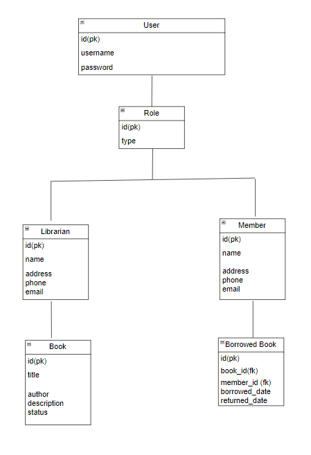

# Library-Management-System

## Description:
This is a library management system that allows users to perform actions based on their roles, either as a librarian or a member.

## Table Structure:
### User Table
| Column   | Description                                               |
|----------|-----------------------------------------------------------|
| id       | Unique identifier for each user                           |
| username | Unique username for each user                             |
| password | Password for each user                                    |
| role     | Role of the user, which can be either LIBRARIAN or MEMBER |
### Book Table
| Column      | Description                                              |
|-------------|----------------------------------------------------------|
| id          | Unique identifier for each book                           |
| title       | Title of the book                                         |
| author      | Author of the book                                        |
| description | Description of the book                                    |
| status      | Status of the book, which can be either AVAILABLE or BORROWED |
### Member Table
| Column   | Description                                             |
|----------|---------------------------------------------------------|
| id       | Unique identifier for each member                        |
| name     | Name of the member                                       |
| address  | Address of the member                                    |
| phone    | Phone number of the member                               |
| email    | Email address of the member                              |
### Borrowed Book Table
| Column         | Description                                           |
|----------------|-------------------------------------------------------|
| id             | Unique identifier for each borrowed book              |
| book_id        | Foreign key reference to the Book Table                |
| member_id      | Foreign key reference to the Member Table              |
| borrowed_date  | Date when the book is borrowed                         |
| returned_date  | Date when the book is returned                         |

## Database Diagram:

## Technologies Used:
- Java
- Spring Boot
- MongoDB
- HTML
- CSS
- JavaScript

## Dependencies: 
- Spring web 
- Spring Data MongoDB 
- Spring Boot DevTools 
- Spring Security 
- Lombok

## API endpoints for each action:
1. /signup (POST): sign up as a LIBRARIAN or MEMBER
2. /login (POST): log in and get a JWT access token
3. /books (GET, POST): get a list of all books or add a new book (for librarians only)
4. /books/:id (GET, PUT, DELETE): get, update, or delete a specific book (for librarians only)
5. /members (GET, POST): get a list of all members or add a new member (for librarians only)
6. /members/:id (GET, PUT, DELETE): get, update, or delete a specific member (for librarians only)
7. /borrow (POST): borrow a book (for members only)
8. /return (POST): return a borrowed book (for members only)
9. /deleteAccount (DELETE): delete the current user's account
