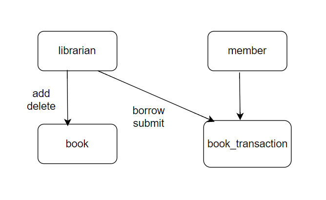

# Library-Management-System

## Description:
This is a library management system that allows users to perform actions based on their roles, either as a librarian or a member.

## Table Structure:
| Table: librarian               |
|-------------------------------|
| id          | integer         |
| username    | string(unique)  |
| password    | string          |

| Table: member                 |
|-------------------------------|
| id          | integer         |
| username    | string(unique)  |
| password    | string          |

| Table: book                   |
|-------------------------------|
| id          | integer         |
| title       | string          |
| author      | string          |
| isbn        | string          |
| status      | enum            |

| Table: book_transaction       |
|-------------------------------|
| id          | integer         |
| book_id     | integer         |
| member_id   | integer         |
| transaction_type | enum        |
| transaction_date | timestamp   |

## Database Diagram:

## Technologies Used:
- Java
- Spring Boot
- MongoDB
- HTML
- CSS
- JavaScript

## Dependencies: 
- Spring web 
- Spring Data MongoDB 
- Spring Boot DevTools 
- Spring Security 
- Lombok

## API endpoints for each action:
1. /signup (POST): sign up as a LIBRARIAN or MEMBER
2. /login (POST): log in and get a JWT access token
3. /books (GET, POST): get a list of all books or add a new book (for librarians only)
4. /books/:id (GET, PUT, DELETE): get, update, or delete a specific book (for librarians only)
5. /members (GET, POST): get a list of all members or add a new member (for librarians only)
6. /members/:id (GET, PUT, DELETE): get, update, or delete a specific member (for librarians only)
7. /borrow (POST): borrow a book (for members only)
8. /return (POST): return a borrowed book (for members only)
9. /deleteAccount (DELETE): delete the current user's account
